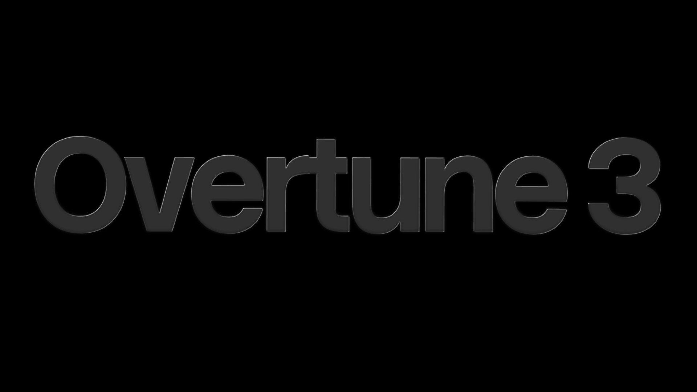

# Overtune 3

Overtune is a desktop application for designing digital filters, analyzing signal response, simulating audio, and exporting filter implementations. It combines a Qt 6 interface with a standalone C++20 DSP library.

[Downloads](https://github.com/shadcy/overtune3/releases) · [Source](https://github.com/shadcy/overtune3) · [Report an issue](https://github.com/shadcy/overtune3/issues)

## Features

- Design low-pass, high-pass, band-pass, and band-stop IIR filters using Butterworth, Chebyshev I/II, elliptic, and Bessel responses.
- Inspect magnitude, phase, group delay, pole-zero, impulse, and step responses.
- Import WAV and CSV data, generate test signals, and compare filtered audio.
- Export filter implementations as C, C++, Python, or JSON.
- Compare calculated filter variants in DSP Chat using engine-generated frequency, phase, delay, pole-zero, and time-response artifacts.
- Use the interface in dark or light appearance.

## DSP Chat

DSP Chat uses OpenRouter-compatible chat completions. Enter an API key and any model ID in **Settings > AI provider**. On Windows the key is protected for the current user with DPAPI; on other platforms it is kept in memory for the current session. Requests are sent directly from the app to OpenRouter.

The DSP engine supplies the active specification, SOS coefficients, roots, verifier results, and response data. When a model requests a comparison, Overtune designs and verifies that variant locally and returns those calculated artifacts to the model and comparison plot. Chat answers are model-generated and should not replace the numeric verifier or engineering review.

Chat responses support Markdown and readable rendering for common LaTeX notation, including Greek symbols, fractions, roots, and powers. If a selected model does not support calculation tools, the chat falls back to qualitative explanations and does not draw a fabricated comparison.

The versioned artifact format, units, precision policy, and model tool contract are documented in [docs/ai-integration.md](docs/ai-integration.md).

## Windows Installation

### Option 1: Standalone Native Installer (Recommended)
1. Download `Overtune3-Setup-x64.exe` when available, or download and extract `overtune3-windows-x64.zip` from [GitHub Releases](https://github.com/shadcy/overtune3/releases).
2. For the portable archive, run its included `ot3-installer.exe`. Choose an installation folder.
3. Click **Install Overtune 3**, then click **Launch Overtune 3**.
4. The installer creates Start Menu and desktop shortcuts and registers the app in Windows Installed Apps. To remove it, use **Settings > Resources & Maintenance > Uninstall**, Windows **Settings > Apps > Installed apps**, or the Start Menu shortcut.

### Option 2: Portable Distribution (Zero Installation)
Download `overtune3-windows-x64.zip`, extract the archive, and double-click `run.bat` or `bin\ot3.exe`.

### Option 3: PowerShell Script Deployment
Run `powershell -ExecutionPolicy Bypass -File .\install_windows.ps1` for automated or silent installations.

## Build

### Requirements

- CMake 3.24 or newer
- Qt 6.4 or newer with Core, Gui, Qml, Quick, QuickControls2, Multimedia, and Network
- A C++20 compiler
- An OpenRouter API key for DSP Chat (optional)

### Windows

The Windows workflow uses one build directory and these commands:

```powershell
build.bat
run.bat
scripts\package_windows.bat
```

`build.bat` configures and deploys the MSVC Release build to `build/windows-release`. `run.bat` launches that exact executable and reports when a build is missing. The packaging script stages the portable app in `dist/overtune3-windows-x64` and writes the portable archive to both `dist` and `dist/release`. When NSIS is installed, it also creates the setup executable in both locations. `dist/release/SHA256SUMS.txt` contains hashes for release files.

### Linux and macOS

```sh
cmake -S . -B build -DCMAKE_BUILD_TYPE=Release
cmake --build build --parallel
```

## DSP Library

The `dsp/` library does not depend on Qt and can be included in another CMake project:

```cmake
add_subdirectory(overtune3/dsp)
target_link_libraries(MyApplication PRIVATE dsp)
```

## Project

Developed and maintained by [@/shadcy](https://github.com/shadcy). Contributions and issue reports are welcome through the [GitHub repository](https://github.com/shadcy/overtune3).

Licensed under the MIT License. See [LICENSE](LICENSE).
